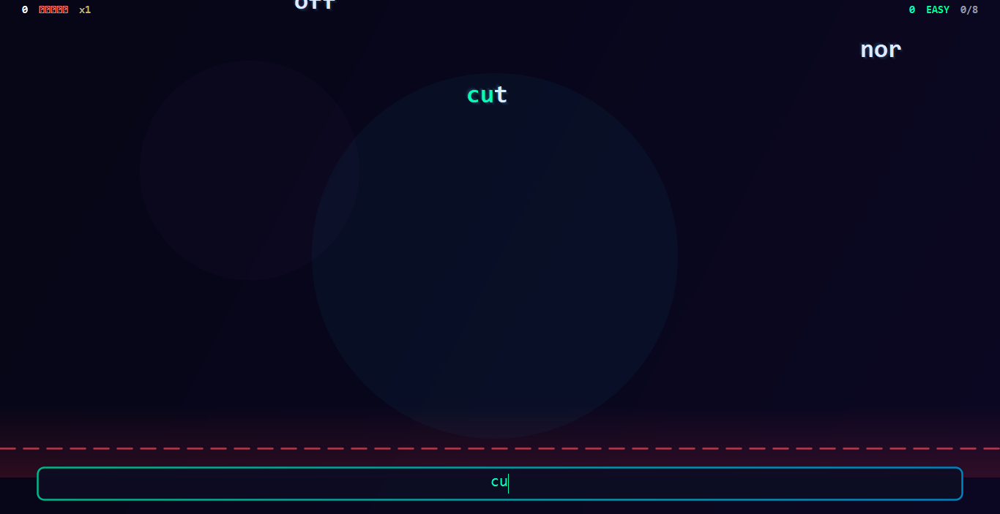
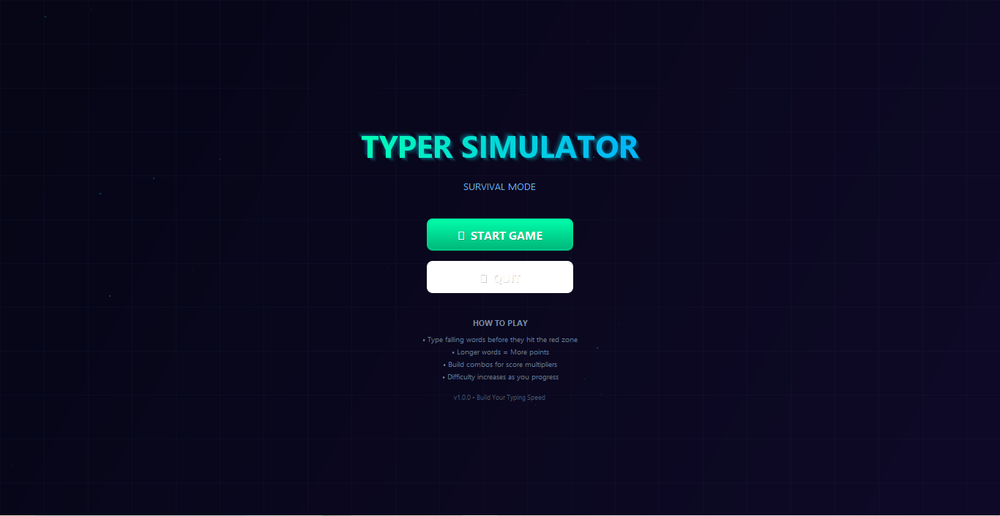

<div align="center">
  
  
  
  <h1 align="center">⌨️ Typer Simulator</h1>
  
  <p align="center">
    <b>A modern, beautiful typing speed game built with Java Swing</b><br>
    <i>Improve your typing speed while having fun!</i>
  </p>
  
  <p align="center">
    
    
    
    
  </p>
  
  <p align="center">
    <a href="#-features">Features</a> •
    <a href="#-installation">Installation</a> •
    <a href="#-how-to-play">How to Play</a> •
    <a href="#-tech-stack">Tech Stack</a>
  </p>
</div>

---

## 🎮 Overview

**Typer Simulator** is a survival-style typing game designed to help you improve your typing speed and accuracy. Words fall from the top of the screen, and you must type them correctly before they reach the danger zone. The game features auto-increasing difficulty, combo multipliers, and stunning visual effects.

---

## ✨ Features

### 🎯 Gameplay
- **Survival Mode** — Type falling words before they hit the red zone
- **Auto-Increasing Difficulty** — Starts easy, progressively gets harder
- **4 Difficulty Tiers** — Easy → Medium → Hard → Expert
- **Combo System** — Build combos for score multipliers (up to x5)
- **500+ Words** — Real typing practice words from common English usage

### 🎨 Visual Design
- **Modern Dark Theme** — Sleek gradient backgrounds with glass morphism
- **Animated Particle Effects** — Beautiful particles on word completion
- **Glowing Neon UI** — Smooth hover animations and glow effects
- **Responsive Layout** — Clean, compact interface

### 📊 Statistics
- **Real-time WPM** — Words per minute tracking
- **Accuracy Tracking** — See your typing precision
- **Score System** — Points based on word length + combo
- **Progress Indicator** — Visual tier progression

---

## 📸 More Screenshots

<p align="center">
  
</p>

---

## 🚀 Installation

### Prerequisites
- **Java 17** or higher
- **Maven** (for building from source)

### Option 1: Download JAR
```bash
# Clone the repository
git clone https://github.com/Zaid102071/Typer-Simulator.git
cd Typer-Simulator

# Run the game
java -jar target/typer-simulator-1.0.0.jar
```

### Option 2: Build from Source
```bash
# Clone and build
git clone https://github.com/Zaid102071/Typer-Simulator.git
cd Typer-Simulator

# Compile with Maven
mvn clean package

# Run
java -jar target/typer-simulator-1.0.0.jar
```

---

## 🎯 How to Play

1. **Start the Game** — Click "START GAME" from the main menu
2. **Type Words** — Words fall from the top; type them before they reach the red danger zone
3. **Build Combos** — Consecutive correct words increase your combo multiplier
4. **Progress Tiers** — Every 8-15 words, difficulty increases
5. **Survive** — You have 5 lives; each missed word costs one life

### Controls
| Key | Action |
|-----|--------|
| `A-Z` | Type letters |
| `Backspace` | Correct mistakes |
| `Enter` | Not required (auto-submit) |

### Scoring
| Word Length | Base Points |
|-------------|-------------|
| 3 letters | 30 |
| 5 letters | 50 |
| 8+ letters | 80+ |

**Combo Multiplier:** x1 → x2 → x3 → x4 → x5 (max)

---

## 🏗️ Tech Stack

| Technology | Purpose |
|------------|---------|
| **Java 17** | Core language |
| **Swing** | GUI framework |
| **Maven** | Build automation |
| **Java 2D** | Custom rendering & animations |

---

## 📁 Project Structure

```
Typer-Simulator/
├── pom.xml                    # Maven configuration
├── README.md                  # Documentation
├── LICENSE                    # MIT License
├── screenshots/               # Game screenshots
│   ├── mainmenu.png
│   └── gameplay.png
└── src/main/java/com/typersimulator/
    ├── Main.java              # Entry point
    ├── core/
    │   ├── GameEngine.java    # Game loop & logic
    │   └── GameState.java     # State enum
    ├── data/
    │   └── WordBank.java      # 500+ word database
    ├── model/
    │   ├── Difficulty.java    # Difficulty scaling
    │   ├── Player.java        # Player stats
    │   └── Word.java          # Word entity
    └── ui/
        ├── GameWindow.java    # Main frame
        ├── MenuPanel.java     # Start screen
        ├── GamePanel.java     # Gameplay screen
        ├── GameOverPanel.java # Results screen
        ├── Theme.java         # Color palette
        └── components/
            ├── ModernButton.java  # Custom button
            ├── GlassPanel.java    # Glass morphism panel
            └── GradientPanel.java # Gradient background
```

---

## 🎨 Design System

### Color Palette
| Color | Hex | Usage |
|-------|-----|-------|
| Primary BG | `#060616` | Background |
| Accent Cyan | `#00E6FF` | Highlights |
| Accent Green | `#00FF96` | Success |
| Accent Purple | `#9664FF` | Expert tier |
| Danger | `#FF5064` | Warning zone |

### Typography
| Font | Usage |
|------|-------|
| Segoe UI | UI text, buttons |
| Consolas | Stats, words |

---

## 📈 Roadmap

- [ ] Sound effects
- [ ] Theme selector (Dark/Light/Cyberpunk)
- [ ] Local leaderboard
- [ ] Achievements system
- [ ] Time Attack mode
- [ ] Zen mode (no lives)
- [ ] Custom word lists

---

## 🤝 Contributing

Contributions are welcome! Please feel free to submit a Pull Request.

1. Fork the repository
2. Create your feature branch (`git checkout -b feature/AmazingFeature`)
3. Commit your changes (`git commit -m 'Add some AmazingFeature'`)
4. Push to the branch (`git push origin feature/AmazingFeature`)
5. Open a Pull Request

---

## 📝 License

This project is licensed under the MIT License - see the [LICENSE](LICENSE) file for details.

---

## 👤 Author

**Zaid**
- GitHub: [@Zaid102071](https://github.com/Zaid102071)

---

<div align="center">
  
  **⭐ If you like this project, give it a star! ⭐**
  
  *Happy Typing! 🚀*
  
</div>
